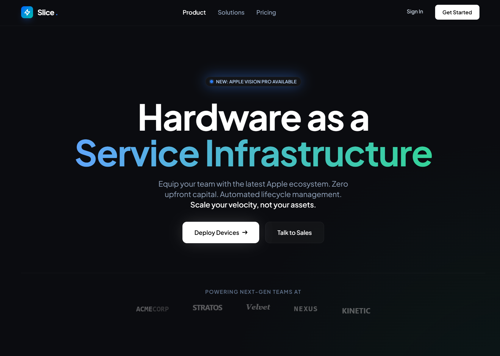
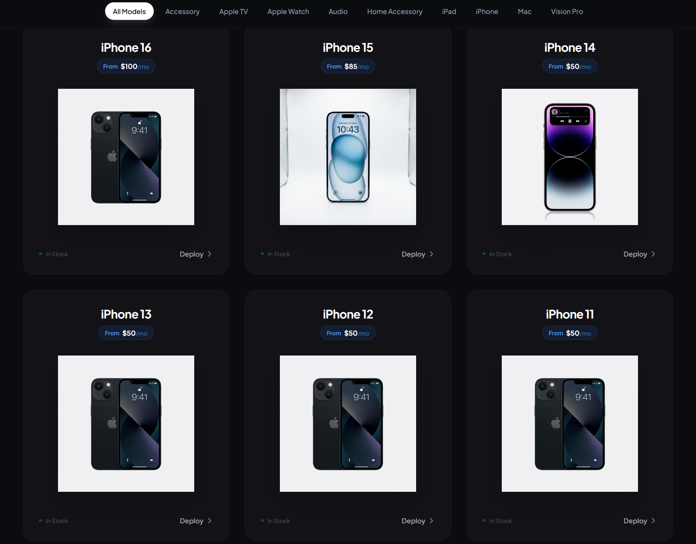
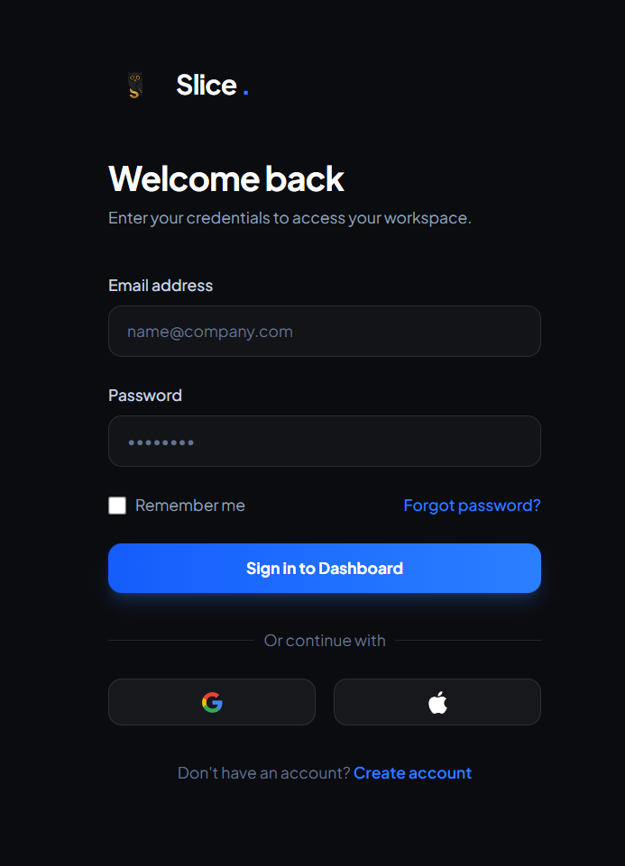
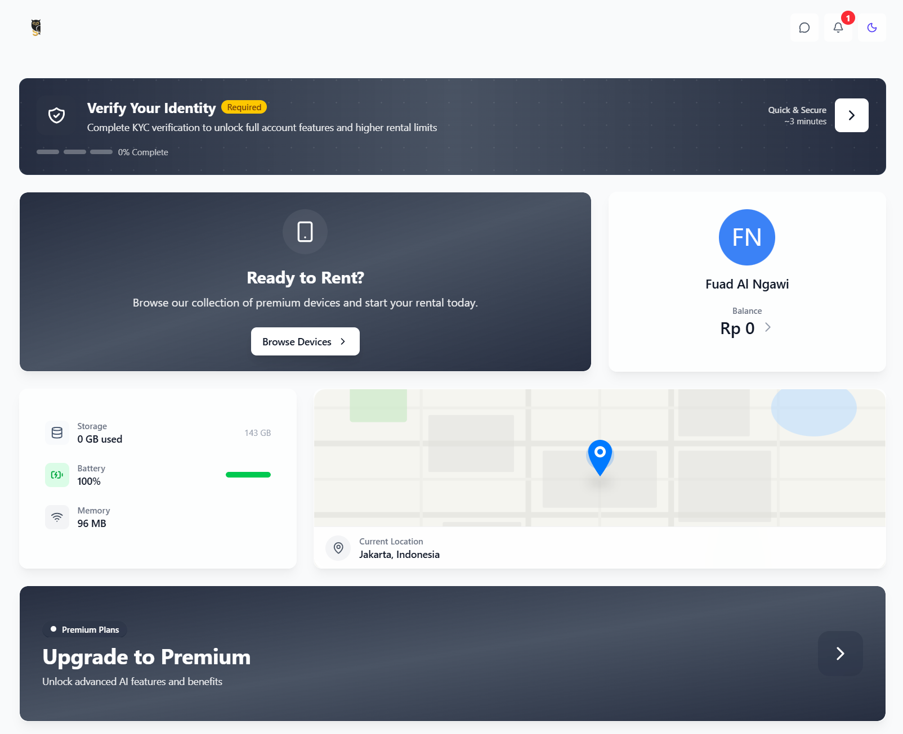
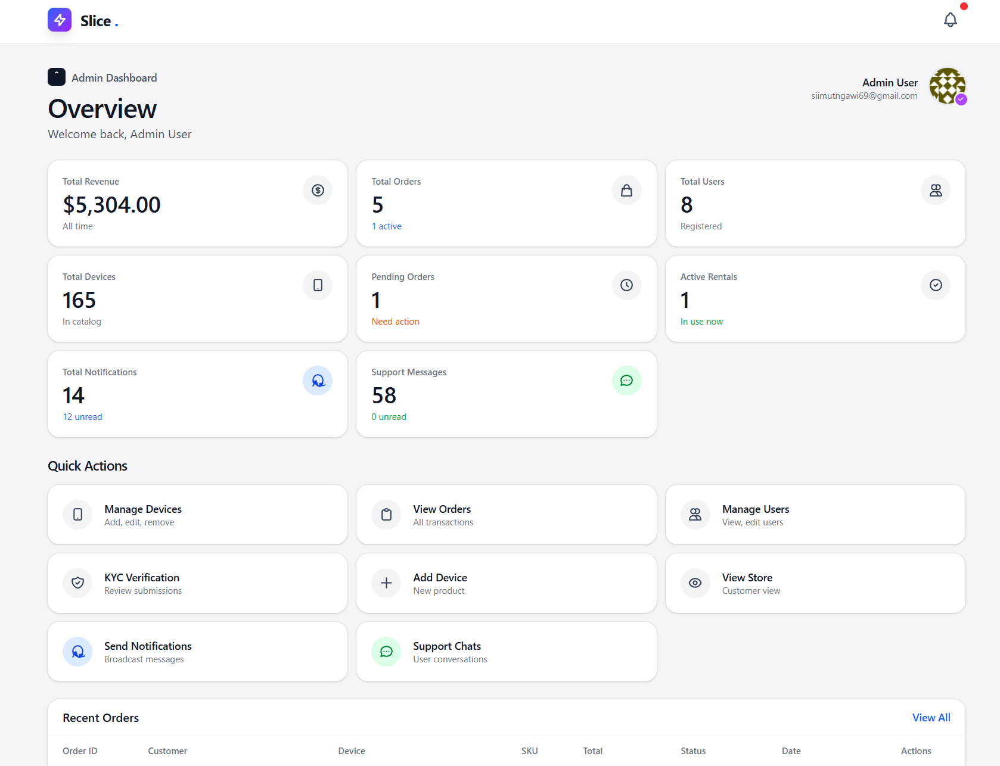
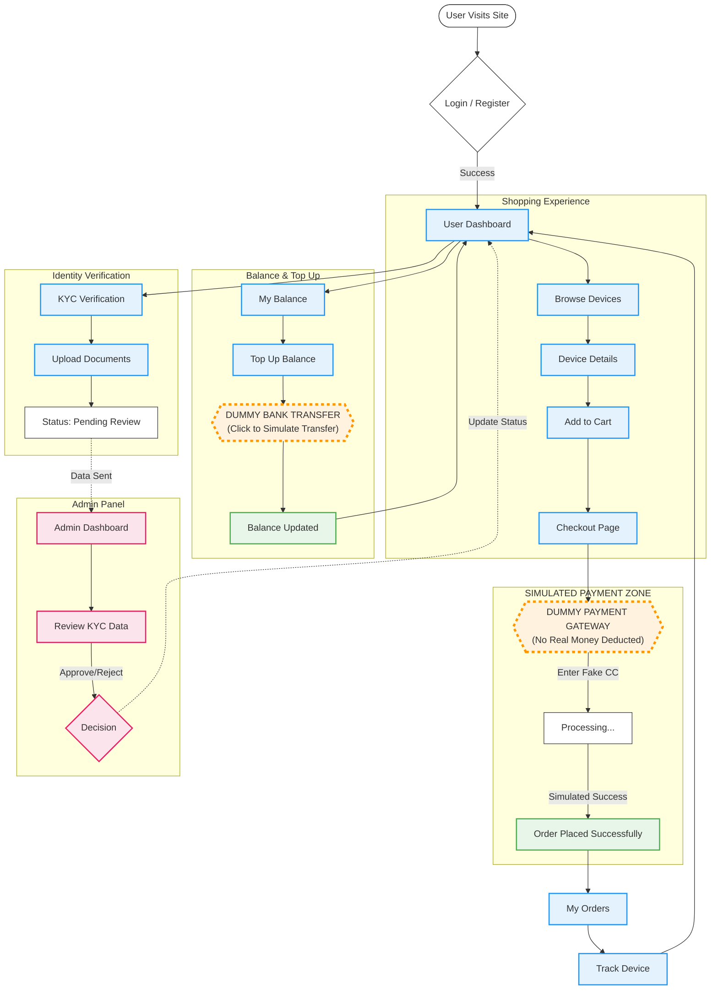

<div align="center">

# Slice

<p align="center">
  <i>Apple Device Rental Platform with Automated Credit Scoring</i>
</p>


<!-- TABLE OF CONTENTS -->
<details>
  <summary>Table of Contents</summary>
  <ul style="list-style: none; padding-left: 0;">
    <li><a href="#screenshots">Screenshots</a></li>
    <li><a href="#flowchart">Flowchart</a></li>
    <li><a href="#core-features">Core Features</a></li>
    <li><a href="#tech-stack">Tech Stack</a></li>
    <li><a href="#quick-start">Quick Start</a></li>
    <li><a href="#configuration">Configuration</a></li>
    <li><a href="#default-accounts">Default Accounts</a></li>
    <li><a href="#credit-scoring">Credit Scoring</a></li>
    <li><a href="#development">Development</a></li>
    <li><a href="#production-deployment">Production Deployment</a></li>
    <li><a href="#api-endpoints">API Endpoints</a></li>
    <li><a href="#documentation">Documentation</a></li>
    <li><a href="#contributing">Contributing</a></li>
    <li><a href="#license">License</a></li>
    <li><a href="#author">Author</a></li>
  </ul>
</details>
</div>

---

> [!NOTE]
> This is a template project containing AI-assisted code. Please review and test thoroughly before use.

## Screenshots











## Flowchart



## Core Features

<table>
<tr>
<td width="33%" valign="top">

### Customer
- Browse & rent devices
- Real-time order tracking
- Credit monitoring
- Instant KYC verification

</td>
<td width="33%" valign="top">

### Admin
- Analytics & insights
- Device & user management
- KYC approval system
- Live support chat

</td>
<td width="33%" valign="top">

### Technical
- Automated credit scoring
- WebSocket real-time sync
- Session security
- Responsive design

</td>
</tr>
</table>

---

## Known Issues

<table>
<tr>
<td width="33%" valign="top">

### Payment
- Simulated gateway only
- No real transactions
- Missing validation

</td>
<td width="33%" valign="top">

### Code Quality
- Debug statements in prod
- Incomplete error handling
- Temp scripts present

</td>
<td width="33%" valign="top">

### Configuration
- Hardcoded fallbacks
- API error handling needed

</td>
</tr>
</table>

---

## Tech Stack

### Backend


### Frontend


### Requirements


## Quick Start

```bash
git clone https://github.com/aditya0w0/Slice.git && cd Slice
composer install && npm install
cp .env.example .env && php artisan key:generate
# Edit .env: set DB_DATABASE, DB_USERNAME, DB_PASSWORD
php artisan migrate && php artisan storage:link && npm run build
```

Run servers (3 terminals):
```bash
php artisan serve         # http://localhost:8000
php artisan reverb:start
npm run dev              # optional
```

## Configuration

### WebSocket (Reverb)

**Local Development**:
```env
REVERB_HOST="localhost"
REVERB_PORT=8080
REVERB_SCHEME=http
```

**Production (ngrok)**:
```env
REVERB_HOST="your-domain.ngrok-free.dev"
REVERB_PORT=443
REVERB_SCHEME=https
```

### Broadcasting
```env
BROADCAST_CONNECTION=reverb
```

## Default Accounts

**Admin**:
```bash
php artisan tinker
```
```php
\App\Models\User::create([
    'name' => 'Admin',
    'email' => 'admin@slice.com',
    'password' => bcrypt('secure_password'),
    'is_admin' => true,
    'kyc_verified' => true,
    'credit_score' => 850
]);
```

## Credit Scoring

**Intelligent Trust System**  
Built on advanced behavioral analytics, our credit engine continuously evaluates trustworthiness through five key dimensions:

- **Identity Verification** — Instant KYC processing with secure biometric validation
- **Payment Intelligence** — Real-time assessment of transaction reliability and history
- **Account Maturity** — Progressive trust building over time
- **Completion Rate** — Success metrics across all rental experiences  
- **Profile Depth** — Comprehensive user verification status

**Dynamic Trust Tiers**  
`Excellent` `Good` `Fair` `Building Trust`

Scores adapt in real-time as behaviors evolve, ensuring fair and personalized access to premium devices.

## Development

```bash
# Cache management
php artisan optimize:clear
php artisan config:cache

# Database
php artisan migrate
php artisan migrate:rollback

# Code generation
php artisan make:controller ControllerName
php artisan make:model ModelName -m

# Asset building
npm run build
npm run dev
```

## Production Deployment

### ngrok Setup

```bash
# Start servers
php artisan serve
./ngrok.exe http 8000
```

Update `.env`:
```env
APP_ENV=production
APP_DEBUG=false
APP_URL=https://your-url.ngrok-free.dev
ASSET_URL=https://your-url.ngrok-free.dev

REVERB_HOST="your-url.ngrok-free.dev"
REVERB_PORT=443
REVERB_SCHEME=https
```

Build and optimize:
```bash
npm run build
php artisan config:cache
php artisan route:cache
php artisan view:cache
composer install --optimize-autoloader --no-dev
```

## API Endpoints

### Authentication
```
POST   /register            Create account
POST   /login               Login
POST   /logout              Logout
```

### Devices
```
GET    /devices             List all devices
GET    /devices/{id}        Device details
GET    /devices/family/{family}  By family
```

### Orders
```
GET    /orders              User orders
POST   /orders              Create order
GET    /orders/{id}         Order details
```

### Cart
```
GET    /cart                View cart
POST   /cart/add            Add item
DELETE /cart/remove/{id}    Remove item
POST   /checkout            Submit order
```

### Admin (Authenticated)
```
GET    /admin/dashboard     Dashboard
GET    /admin/devices       Manage devices
GET    /admin/orders        Manage orders
GET    /admin/users         Manage users
GET    /admin/kyc           KYC approvals
GET    /admin/notifications Send notifications
GET    /admin/chat          Support chat
```

## Documentation

- [CHANGELOG.md](CHANGELOG.md) - Project history
- [SECURITY.md](SECURITY.md) - Security configuration
- [SESSION_SECURITY.md](SESSION_SECURITY.md) - Session management
- [RISK_ALGORITHM.md](RISK_ALGORITHM.md) - Credit scoring details
- [ALGORITHM_QUICK_REF.md](ALGORITHM_QUICK_REF.md) - Algorithm reference

## Contributing

1. Fork the repository
2. Create feature branch (`git checkout -b feature/Feature`)
3. Commit changes (`git commit -m 'Add feature'`)
4. Push to branch (`git push origin feature/Feature`)
5. Open Pull Request

Follow PSR-12 for PHP, use Prettier for JavaScript/React, and adhere to Laravel best practices.

## License

MIT License - see [LICENSE](https://opensource.org/licenses/MIT)

## Author

Aditya Galang Tri Cahaya - [@aditya0w0](https://github.com/aditya0w0)

---

<p align="center">Copyright (c) 2025 Slice Team</p>
